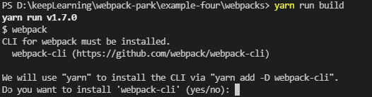
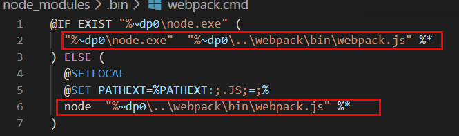
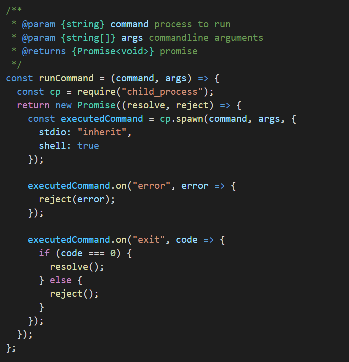
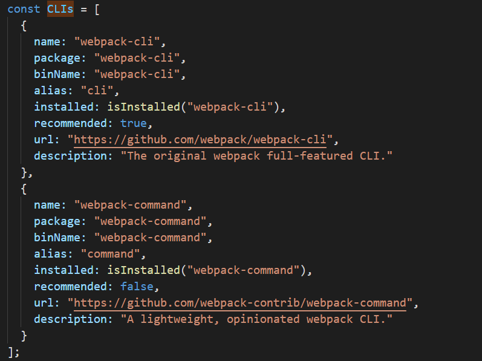
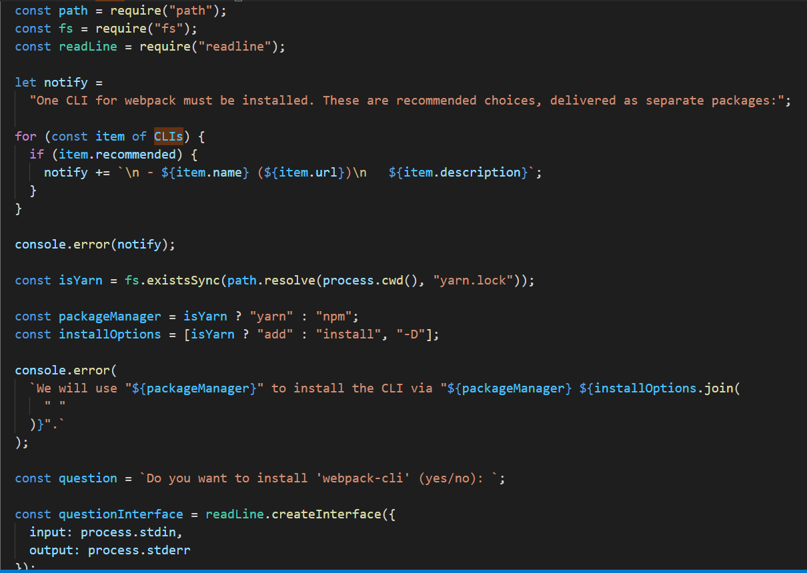

### webpack入门到放弃

####  入门指南：

#### 一、webpack概念

* webpack、electron等前端工具的出现都是得益于NodeJs的出现
* Webpack作为前端工程化的重要一环，其作用是前端资源模块化管理和打包工具

* 主要解决的问题
- 代码拆分（Code Splitting）: 可以将应用程序分解成可管理的代码块，可以按需加载，这样用户便可快速与应用交互，而不必等到整个应用程序下载和解析完成才能使用，以此构建复杂的单页应用程序（SPA）；

- 静态资源（Static Assets）: 可以将所有的静态资源，如 js、css、图片、字体等，导入到应用程序中，然后由 webpack 使用 hash 重命名需要的资源文件，而无需为文件 URL 增添 hash 而使用 hack 脚本，并且一个资源还能依赖其他资源。

- [webpack历史](https://segmentfault.com/a/1190000019650480)

#### 二、webpack配置（从零到一搭建项目）

* 1、安装webpack
    通过 yarn add webpack webpack-cli --dev （或npm）

    * 1.1 为什么需要安装webpack-cli ？
        - 
        - webpack4 与 webpack3相比webpack4将cli单独分离了出来。
        - 在package.json中script配置dev: webpack --mode development，当执行npm run dev相当于执行webpack --mode development，
        webpack.cmd执行时会判断当前目录下是否存在node执行程序，如果存在就使用当前node进程执行node_modules/webpack/bin/webpack.js，如果当前目录下不存在node进程，则使用全局（也就是本地）node执行node_modules/webpack/bin/webpack.js文件
        - 
        - 
        - node_modules/webpack/bin/webpack.js首先会判断是否安装了webpack-cli模块，如果没有安装webpack-cli模块就会引导用户去安装，如果已经安装了webpack-cli模块，就会去执行node_modules\webpack-cli\bin\cli.js

         - 源码解析：
         -  
         -  
         -  
         
    * 1.2 cli作用
        - 使用命令行工具包 yargs，使命令行界面更优雅并对参数配置并解析（process.args）
        - 分析命令参数，对各个参数进行转换，统一组成新的编译配置项
        - 引用webpack，根据参数项对源代码进行编译和构建

* 2、安装重要的依赖包

- babel  
* Babel 是一个工具链，主要用于将采用 ECMAScript 2015+ 语法编写的代码转换为向后兼容的 JavaScript 语法
* babel转换步骤：ES6代码输入 ==》 @babel/parser进行解析 ==》 得到AST==》 plugin用babel-traverse对AST树进行遍历转译 ==》 得到新的AST树==》 用babel-generator通过AST树生成ES5代码
* [babel AST](https://juejin.cn/post/6962861837800964133)

- url-loader， css-loader， file-loader等loader
- uglifyjs-webpack-plugin 等插件

* 3、如何配置webpack.config.js
  - entry  入口
  - export 出口
  - loader 单一职责
  - plugin 合理使用插件

* 4、我们项目中配置
  - vue create （vue-cli已经升级无webpack配置，必须通过vue.config.js。与CRA项目一样eject，可以inspect）
  - vue init webpack vue_project  

#### 三、webpack、rollup使用建议

正是因为 webpack 拥有如此强大的功能，所以 webpack 在进行资源打包的时候，就会产生很多冗余的代码（如果你有查看过 webpack 的 bundle 文件，便会发现）。比如，把 export default str => str; 这段代码用 webpack 打包就会得到下面的结果：

这在以下的一些情境中就不太高效，需要寻求更好的解决方案：
- 需要 js 高效运行。因为 webpack 对子模块定义和运行时的依赖处理（__webpack_require__），不仅导致文件体积增大，还会大幅拉低性能；
- 项目（特别是类库）只有 js，而没有其他的静态资源文件，使用 webpack 就有点大才小用了，因为 webpack bundle 文件的体积略大，运行略慢，可读性略低。

#### 进阶指南

####  一、webpack实现原理（总结）

#### 初始化阶段
- 将 process.args + webpack.config.js 合并成用户配置
- 调用 validateSchema 校验配置
- 调用 getNormalizedWebpackOptions + applyWebpackOptionsBaseDefaults 合并出最终配置
- 创建 compiler 对象
- 遍历用户定义的 plugins 集合，执行插件的 apply 方法
- 调用 new WebpackOptionsApply().process 方法，加载各种内置插件

- 主要逻辑集中在 WebpackOptionsApply 类，webpack 内置了数百个插件，这些插件并不需要我们手动配置，WebpackOptionsApply 会在初始化阶段根据配置内容动态注入对应的插件，包括：

- 注入 EntryOptionPlugin 插件，处理 entry 配置
- 根据 devtool 值判断后续用那个插件处理 sourcemap，可选值：EvalSourceMapDevToolPlugin、SourceMapDevToolPlugin、EvalDevToolModulePlugin
- 注入 RuntimePlugin ，用于根据代码内容动态注入 webpack 运行时

#### 构建阶段
- 调用 handleModuleCreate ，根据文件类型构建 module 子类
- 调用 loader-runner 仓库的 runLoaders 转译 module 内容，通常是从各类资源类型转译为 JavaScript 文本
- 调用 acorn 将 JS 文本解析为AST
- 遍历 AST，触发各种钩子
  a. 在 HarmonyExportDependencyParserPlugin 插件监听 exportImportSpecifier 钩子，解读 JS 文本对应的资源依赖
  b. 调用 module 对象的 addDependency 将依赖对象加入到 module 依赖列表中
- AST 遍历完毕后，调用 module.handleParseResult 处理模块依赖
- 对于 module 新增的依赖，调用 handleModuleCreate ，控制流回到第一步
- 所有依赖都解析完毕后，构建阶段结束

#### 生成阶段
- 构建本次编译的 ChunkGraph 对象；
- 遍历 compilation.modules 集合，将 module 按 entry/动态引入 的规则分配给不同的 Chunk 对象；
- compilation.modules 集合遍历完毕后，得到完整的 chunks 集合对象，调用 createXxxAssets 方法
- createXxxAssets 遍历 module/chunk ，调用 compilation.emitAssets 方法将 assets 信息记录到 compilation.assets 对象中
- 触发 seal 回调，控制流回到 compiler 对象

这一步的关键逻辑是将 module 按规则组织成 chunks ，webpack 内置的 chunk 封装规则比较简单：
entry 及 entry 触达到的模块，组合成一个 chunk
使用动态引入语句引入的模块，各自组合成一个 chunk

#### 总结
* 设计任务：内容转换 + 资源合并
*  架构简化为：compiler + compilation + plugins, 理解这三个核心对象的设计、职责、协作 ：
* webpack 运行过程中只会有一个 compiler ；而每次编译 —— 包括调用 compiler.run 函数或者 watch = true 时文件发生变更，都会创建一个 compilation 对象

#### 二、Tree Shaking性能优化实践

#### 三、loader原理解析

#### 四、Plugin原理解析

#### 五、Chunk 分包规则

### 文档资源

- [系列](https://segmentfault.com/a/1190000040008841)
- [webpack基础配置](https://www.toptal.com/javascript/a-guide-to-managing-webpack-dependencies)
- [webpack文档](https://v4.webpack.docschina.org/concepts/)
- [入门指南](https://zhaoda.net/webpack-handbook/module-system.html)
- [入门到进阶， 各个api讲解](https://www.mdnice.com/writing/7347c59a220c402495e3f4086911a1af)
- [ Webpack 核心原理 ](https://mp.weixin.qq.com/s/SbJNbSVzSPSKBe2YStn2Zw)
- [tapable - 钩子理解](https://zhuanlan.zhihu.com/p/79221553)

